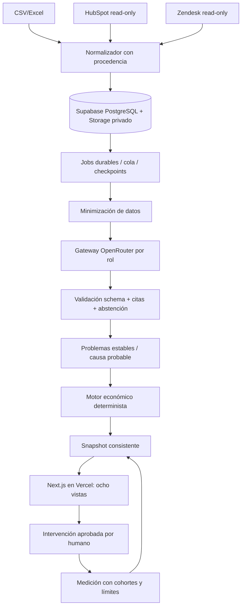

# VEXA — Blueprint maestro de 30 días

Versión 0.1, preparación 2026-09-18. Leer primero `../CONTEXTO-CANONICO.md`. Este blueprint no certifica que el producto ya exista. Los días son relativos a un kickoff con responsables; si se adopta 2026-09-19, día 30 es 2026-10-18. Fecha exacta de pitch y migración sigue pendiente.

## Objetivo demostrable
Un usuario de una empresa autorizada carga/conecta conversaciones y datos de negocio, observa progreso durable, entiende en cinco minutos los problemas priorizados, inspecciona evidencia/cálculo, asigna una intervención y ve un brief con cifras que se pueden reproducir. Segundo tenant no puede leer ni modificar el primero. Demostrar portabilidad HubSpot/Zendesk cuando ambos accesos estén disponibles. No prometer causalidad ni ahorros que un mes no permite medir.

## Arquitectura propuesta

Auth Supabase y RLS en toda ruta. Frontend TS/React con sistema visual propio; SQL agrega y filtra; pgvector sólo con tenant predicate y modelo/dimensión versionados. Vercel sirve UI/API, no un proceso infinito de análisis. S05 decide ejecución durable entre cola+workers cortos y Workflow; implementar sólo ganador. GitHub privado y Actions separan pruebas locales, DB, E2E, evals y promoción. Runtime OpenRouter tiene factura propia: Codex se usa para construir, no para atender clientes.

## Ruta crítica y compuertas
| Fase | Días | Entrega | Gate |
|---|---:|---|---|
| F00 | 1–2 | Datos/permiso/scope, fichas de pruebas, diseño, repo local | NDA/autorización para datos reales; fixtures permiten seguir sin ellos |
| F01 | 2–5 | App, auth, tenant, storage, migrations, CI y UI shell | Login y aislamiento dos tenants; ningún secreto al browser |
| F02 | 4–8 | CSV/Excel, validación, preview de mappings, durable jobs | 10K registros sintéticos contabilizados: accepted+rejected+duplicate, reanudación sin pérdida |
| F03 | 6–12 | HubSpot/Zendesk read-only y aliases migración | Contratos paginados probados; acceso real documentado por separado |
| F04 | 8–15 | Gateway, PII, extracción, citas, clusters estables | Schema/citas/abstención; gold humano y evals si datos disponibles |
| F05 | 12–18 | Ledger financiero, snapshots y prioridad | FIN críticos al 100%; sumas no duplicadas; null y ventanas correctos |
| F06 | 15–23 | Ocho vistas integradas, recomendaciones/intervenciones/brief | E2E de flujo de cada rol; UI/API/export consistentes |
| F07 | 22–27 | Seguridad, rendimiento, resiliencia, accesibilidad y piloto | RLS real, caos, restore, sin P0/P1 reproducibles abiertos |
| F08 | 28–30 | Preview→producción autorizada, demo y pitch/data room | SHA servido, smoke remoto, plan B, claims respaldados |

Solapamientos sólo con contratos congelados. No significa que ocho fases puedan escribir el mismo esquema al mismo tiempo. Cada fase tiene documento propio y grafo de tareas en `../../orchestration/graph.json`.

## Ocho vistas con una única fuente financiera
1. Overview `/dashboard`: riesgos/costos distintos, top 5 y tres prioridades, datos as_of/cobertura.
2. Problems `/problems`: ordenamiento, filtros de fecha/SKU/canal/geografía/segmento/severidad y resultados no aditivos señalados.
3. Detail `/problems/[id]`: evidencia original autorizada, causa probable vs confirmada, afectados únicos, tendencia, desglose financiero y metodología.
4. Recommendations `/recommendations`: acción específica con evidencia, condición, esfuerzo y oportunidad en rango; dismiss/owner/intervention con historial.
5. Explorer `/explorer`: preguntas permitidas sobre agregados y evidencias tenant-scoped. No SQL libre ni herramientas arbitrarias. Cada respuesta cita consultas/snapshot.
6. Customers `/customers/[id]`: órdenes/conversaciones/refunds pertinentes con minimización de PII. Riesgo calibrado o desconocido, no score inventado.
7. Interventions `/interventions`: responsables, estados, línea base congelada, ventana post y cambios descriptivos.
8. Brief `/briefs`: resumen semanal con período/estado del feed; primero in-app/export, email sólo cuando se aprueben proveedor/destinatarios.

Adicionales imprescindibles, no «pantallas de negocio» nuevas: login, onboarding/import, conexiones, configuración de organización y estado de jobs. No confundir ocho core screens con ausencia de setup operativo.

## Requisitos de datos
Entidades adicionales a las del PRD: memberships, source_connections, external_identities, messages y revisions, ingestion_runs/items, economic_events/reversals, problem_memberships, evidence_spans, model_runs, metric_definitions/assumptions, snapshots, interventions/events y audit_events. Toda relación tenant-aware, índices compuestos e idempotencia. Ver `01-CONTRATOS-Y-DATOS.md` y dossier `calidad/`.

## Qué no se recorta por fecha
Aislamiento tenant, control de acceso, trazabilidad de dinero/citas, no exposición de secretos, reintento idempotente y estados de error, consentimiento de datos y claims honestos. Si falta tiempo se recorta sofisticación de explorer, correo, forecasts o integraciones secundarias; no seguridad.

## Qué queda después del pitch
Shopify nativo, Amazon/Walmart/Best Buy APIs completas, Jira/Slack writeback aprobado, alertas operativas, billing autoservicio, SSO/SCIM, controles enterprise, cohortes causales robustas y experimentación, personalización multiindustria, agentes que ejecutan acciones. Cada expansión necesita consentimiento, casos gold, ROI y capacidad operativa; no feature factory.

## Criterio de fin de fase y fin del programa
Un documento o commit no marca done. Cada tarea necesita comando/verificador, salida y artefactos asociados a SHA. Blocked/not_run no cuentan como pass. Fin técnico local, pitch-ready y producción son estados diferentes. Negocio/legales y evaluación humana tienen gates explícitos: un loop no los resuelve por insistencia.
